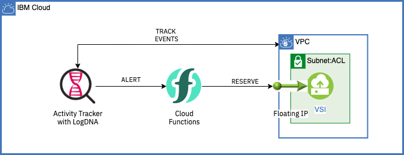

# Extend VPC instances with Cloud Functions and Activity tracker with LogDNA
:warning: Work in progress

You can use the IBM Cloud Activity Tracker with LogDNA service to track how users and applications interact with IBM Cloud Virtual Private Cloud (VPC).

IBM Cloud Activity Tracker with LogDNA records user-initiated activities that change the state of a service in IBM Cloud. You can use this service to investigate abnormal activity and critical actions and to comply with regulatory audit requirements. **In addition, you can be alerted about actions as they happen.**

With IBM Cloud Functions, you can use your favorite programming language to write lightweight code that runs app logic in a scalable way. You can run code on-demand with HTTP-based API requests from applications or run code in response to IBM Cloud services and third-party events. The Function-as-a-Service (FaaS) programming platform is based on the open source project Apache OpenWhisk. **A web action is accessible through a REST interface without the need for credentials.**

Bringing the alerting about the actions capability of Activity tracker and web actions in Cloud functions, you will be reserving a floating IP as and when a new VSI is provisioned in the VPC.



### Pre-requisites

1. Install IBM Cloud CLI by following the [instructions here](https://cloud.ibm.com/docs/cli?topic=cli-install-ibmcloud-cli) and log into your IBM Cloud account
2. Run the below script to setup the required prerequisites for this use-case,

    ```sh
    ./00-prereqs.sh
    ```
3. The script installs the following on your machine,

    | Pre\-req                                                  | Used to                                               |
    |-----------------------------------------------------------|--------------------------------------------------------|
    | Infrastructure service / VPC Infrastructure \(is\) plugin | check the VPC resources                             |
    | Cloud Functions(fn) plugin                                    | create namespace, actions and for checking the logs |
    | Schematics plugin                                         | provision VPC resources                             |
