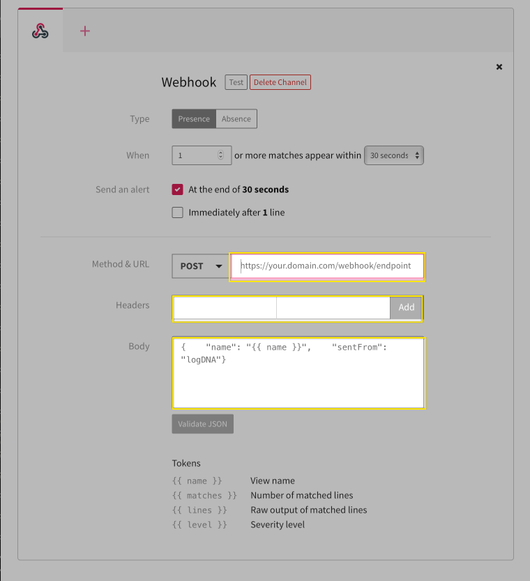

# Extend VPC resources with Cloud Functions and Activity tracker with LogDNA
:warning: Work in progress

You can use the IBM Cloud Activity Tracker with LogDNA service to track how users and applications interact with IBM Cloud Virtual Private Cloud (VPC).

[IBM Cloud Activity Tracker with LogDNA](https://cloud.ibm.com/docs/Activity-Tracker-with-LogDNA?topic=Activity-Tracker-with-LogDNA-getting-started) records user-initiated activities that change the state of a service in IBM Cloud. You can use this service to investigate abnormal activity and critical actions and to comply with regulatory audit requirements. **In addition, you can be alerted about actions as they happen.**

With [IBM Cloud Functions](https://cloud.ibm.com/functions/), you can use your favorite programming language to write lightweight code that runs app logic in a scalable way. You can run code on-demand with HTTP-based API requests from applications or run code in response to IBM Cloud services and third-party events. The Function-as-a-Service (FaaS) programming platform is based on the open source project Apache OpenWhisk. **A web action is accessible through a REST interface without the need for credentials.**

Bringing the alerting about the actions capability of Activity tracker and web actions in Cloud functions, you will be reserving a floating IP as and when a new VSI (instance) is provisioned in the VPC.


### Pre-requisites

1. Install IBM Cloud CLI by following the [instructions here](https://cloud.ibm.com/docs/cli?topic=cli-install-ibmcloud-cli) and log into your IBM Cloud account with `ibmcloud login` command
2. Run the below script to setup the required prerequisites for this use-case,

    ```sh
    ./00-prereqs.sh
    ```
   The script installs the following on your machine,

    | Pre\-req                                                  | Used to                                               |
    |-----------------------------------------------------------|--------------------------------------------------------|
    | Infrastructure service / VPC Infrastructure (is) plugin | check the VPC resources                             |
    | Cloud Functions(fn) plugin                                    | create namespace, actions and for checking the logs |
    | Schematics plugin                                         | provision VPC resources                             |

    Other tools like Docker and jq.

3. Copy the configuration file and set the values to match your environment. *Check the comments above each environment variable for more information*
   ```sh
   cp .env.template .env
   edit .env
   ```
4. Load the values into the current shell
   ```sh
   source .env
   ```

### Provision the Cloud service

In this section, you will provision the IBM Cloud service required for this use-case,

1. Run the below command,
   ```sh
   ./01-services.sh
   ```
2. The script provisions a IBM Cloud Activity Tracker with LogDNA service with 7-day event search plan, creates an access group, adds the required policies and adds the users to the access group. *Every user that accesses the IBM Cloud Activity Tracker with LogDNA service in your account must be assigned an access policy with an IAM user role defined.*

You will configure the Activity Tracker with LogDNA service to look for VPC specific events in the coming sections.

### Create the cloud functions action

In this section, you will create
- a namespace: Namespaces contain Cloud Functions entities, such as actions and triggers, and belong to a resource group. You can let users access your entities by granting them access to the namespace.
- a Python action to reserve and bind a floating IP to a newly provisioned VSI

1. Run the below command,
   ```sh
   ./02-functions.sh
   ```
   The script uses contents of **functions** folder of the cloned repo.

   **functions/**

      * [\_\_main\_\_.py](./functions/__main__.py)
      * [helper.py](./functions/helper.py)
      * [init.sh](./functions/init.sh)
      * [requirements.txt](./functions/requirements.txt)

   The python(.py) files use [vpc-python-sdk](https://github.com/IBM/vpc-python-sdk) to create and bind a floating IP to an instance. The script internally calls another script `init.sh` that pulls `ibmfunctions/action-python-v3.7` container image, installs the dependencies mentioned in `requirements.txt` and creates a virtual environment(virtualenv). Once done, the code in `.py` files along with the created virtualenv is zipped and a Python action is created using the `functions.zip` file.

   This is one of the many ways to [package your Python code](https://cloud.ibm.com/docs/openwhisk?topic=openwhisk-prep#prep_python).

2. The script also creates a secured [web action](https://cloud.ibm.com/docs/openwhisk?topic=openwhisk-actions_web). When you create a web action, the result is a URL that can be used to trigger the action from any web app. In this case, you will use the URL in Activity tracker with LogDNA service.

    Web actions can be invoked without authentication and can be used to implement HTTP handlers that respond with headers, statusCode, and body content of different types. Using `--web-secure` flag in the command, You can secure your web action that returns a token (number) under `require-whisk-auth` annotation. **Save the `URL` and the value of `require-whisk-auth` key (a number) from the command output or keep the terminal open**.

### Configure the Activity tracker with LogDNA

In this section, you will create a LogDNA view and an alert from the view. Views are saved shortcuts to a specific set of filters and search queries. You can see the list of views in the Views pane on the left.

1. Navigate to [IBM Cloud Observability](https://cloud.ibm.com/observe) page and click **Activity Tracker** on the left pane.
2. Click on **View LogDNA** next to the service you provisioned. A new tab will be launched with default **Everything** view.
3. In the search box, enter `action:is.instance.instance.create  reason.reasonType:Created` and click **Enter/Return** on your keyboard. *You are filtering for a successful VSI (instance) create event from the logs.*
4. On the top bar, click on **Unsaved View** and then **Save as new view / alert**
   - Provide `instance-extension` as the name
   - Select `View-specific alert` from the Alert dropdown menu
   - Click on **Webhook**
5. Under **Method & URL**, next to `POST` enter the web action URL you saved earlier.
6. Under **Headers**, in the first box, enter `X-Require-Whisk-Auth` as the key and the `require-whisk-auth` value(number) that you saved earlier in the second box and then click **Add**.
   
7. Under **Body**, copy and paste the following JSON. Once done, click on **validate JSON**
   ```json
   {
	"sentFrom": "logDNA",
	"matches": "{{ matches }}",
	"lines": "{{ lines }}"
   }
   ```
   The `matches` include number of logs matching the query in the search filter. The `lines` include details of an instance like instance ID that will be passed to the Python action. Using this info, the action reserves a floating IP to the instance.
8. To verify, click on **Test** next to the title(Webhook). *Before hitting test, you may want to open your terminal or command prompt and run `ibmcloud fn activation poll` command to check logs for incoming activations*
9. To see the logs of your last invoked action, open a terminal or command prompt and run the below command
    ```sh
    ibmcloud fn activation logs $(ibmcloud fn activation list | awk 'FNR == 2 {print $3}')
    ```
    The last lines in the logs should look something similar to
    ```
    '__ow_method': 'post',
	 '__ow_path': '',
	 'lines': '{"_line":"This is where your lines will show up", "_app":"alert_tester", "_host":"logdna", "_ts":1595247917277},{"_line":"After matching at least 1 lines in a 30 second period, we\'ll send an alert to this email with all the matched lines", "_app":"alert_tester", "_host":"logdna", "_ts":1595247917277}',
	 'matches': '2',
	 'sentFrom': 'logDNA'
    ```
10. Click on **Save View**. The view should appear on the left pane under Views.*Don't close this browser or tab*

### Test the flow by provisioning VPC resources

In this section, you will test the complete flow by provisioning VSIs in a VPC

1. Run the below command
   ```sh
   ./03-vpc.sh
   ```
   The script after successful execution provisions
   - a VPC
   - a subnet
   - two VSIs as mentioned in your `.env` file

   The script uses [Schematics](https://cloud.ibm.com/schematics/overview) to provision the VPC resources. With Schematics, You can enable Infrastructure as Code (IaC) by codifying your IBM Cloud resources with Terraform and use Schematics workspaces to start automating the provisioning and management of your resources.
2. Run the below command to see the VSIs **without** floating IPs assigned
   ```sh
   ibmcloud is instances
   ```
3. You can also confirm the instance creation by navigating to the LogDNA view `instance-extension`.
4. To check whether the action invoked successfully and also to check the action logs, run the below command
   ```sh
   ibmcloud fn activation logs $(ibmcloud fn activation list | awk 'FNR == 2 {print $3}')
   ```
5. Re-run the `ibmcloud is instances` command to see the VSIs with floating IPs.
6. To provision more VSIs, update the `TF_VAR_instance_count` variable in the `.env` file, source the `.env` and re-run the `03-vpc.sh` script.

### Cleanup

Run the below script to delete everything,

```sh
./04-cleanup.sh
```