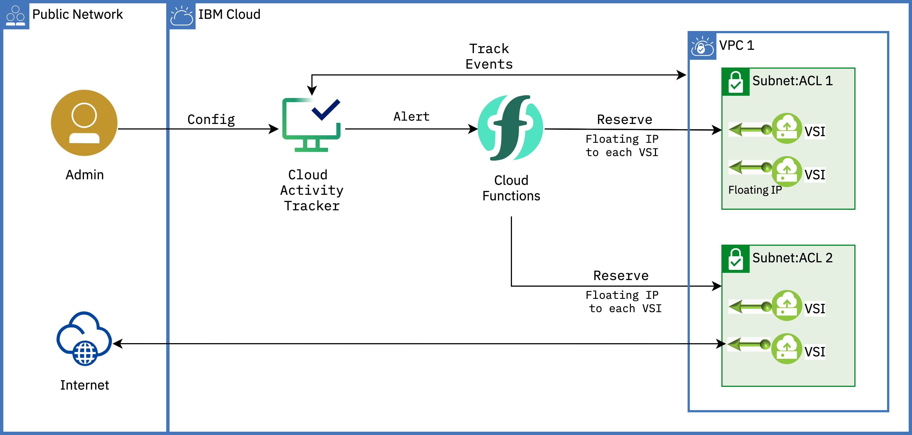

# Extend VPC instances with Cloud Functions and Activity tracker with LogDNA
:warning: Work in progress

You can use the IBM Cloud Activity Tracker with LogDNA service to track how users and applications interact with IBM Cloud Virtual Private Cloud (VPC).

IBM Cloud Activity Tracker with LogDNA records user-initiated activities that change the state of a service in IBM Cloud. You can use this service to investigate abnormal activity and critical actions and to comply with regulatory audit requirements. **In addition, you can be alerted about actions as they happen.**

With IBM Cloud Functions, you can use your favorite programming language to write lightweight code that runs app logic in a scalable way. You can run code on-demand with HTTP-based API requests from applications or run code in response to IBM Cloud services and third-party events. The Function-as-a-Service (FaaS) programming platform is based on the open source project Apache OpenWhisk. **A web action is accessible through a REST interface without the need for credentials.**

Bringing the alerting about the actions capability of Activity tracker and web actions in Cloud functions, you will be reserving a floating IP as and when a new VSI is provisioned in the VPC.



### Pre-requisites

1. Install IBM Cloud CLI by following the [instructions here](https://cloud.ibm.com/docs/cli?topic=cli-install-ibmcloud-cli) and log into your IBM Cloud account
2. Run the below script to setup the required prerequisites for this use-case,

    ```sh
    ./00-prereqs.sh
    ```
   The script installs the following on your machine,

    | Pre\-req                                                  | Used to                                               |
    |-----------------------------------------------------------|--------------------------------------------------------|
    | Infrastructure service / VPC Infrastructure \(is\) plugin | check the VPC resources                             |
    | Cloud Functions(fn) plugin                                    | create namespace, actions and for checking the logs |
    | Schematics plugin                                         | provision VPC resources                             |

    Other tools like Docker and jq.

### Provision the Cloud service

In this section, you provision the IBM Cloud service required for this use-case,

Run the below command,
   ```sh
   ./01-services.sh
   ```
   The script will provision IBM Cloud Activity Tracker with LogDNA service, create an access group, add the required policies and add the users to the access group. *Every user that accesses the IBM Cloud Activity Tracker with LogDNA service in your account must be assigned an access policy with an IAM user role defined.*

You will configure the Activity Tracker with LogDNA service to look for VPC specific events in the coming sections.

### Create the cloud functions action

In this section, you will create
- a namespace: Namespaces contain Cloud Functions entities, such as actions and triggers, and belong to a resource group. You can let users access your entities by granting them access to the namespace.
- a Python action to reserve and bind a floating IP to a newly provisioned VSI

1. Run the below command,
   ```sh
   ./02-functions.sh
   ```
   The artifacts used in the script are under **functions** folder. The scripts internally calls another script `init.sh` that pulls `ibmfunctions/action-python-v3.7` container image, installs the dependencies mentioned in `requirements.txt` and creates a virtual environment(virtualenv). Once done, the code in `.py` files along with the created virtualenv is zipped and a Python action is created using the `functions.zip` file.

   This is one of the many ways to [package your Python code](https://cloud.ibm.com/docs/openwhisk?topic=openwhisk-prep#prep_python) if the dependencies are not supported by Cloud Functions
2. The script also creates a secured [web action](https://cloud.ibm.com/docs/openwhisk?topic=openwhisk-actions_web). When you create a web action, the result is a URL that can be used to trigger the action from any web app. In this case, you will use the URL in Activity tracker with LogDNA service.

    Web actions can be invoked without authentication and can be used to implement HTTP handlers that respond with headers, statusCode, and body content of different types. Using `--web-secure` flag in the command, You can secure your web action that returns a token (number) under `require-whisk-auth` annotation. **Save the `URL` and the value of `require-whisk-auth` key (a number) from the command output or keep the terminal open**.

### Configure the Activity tracker with